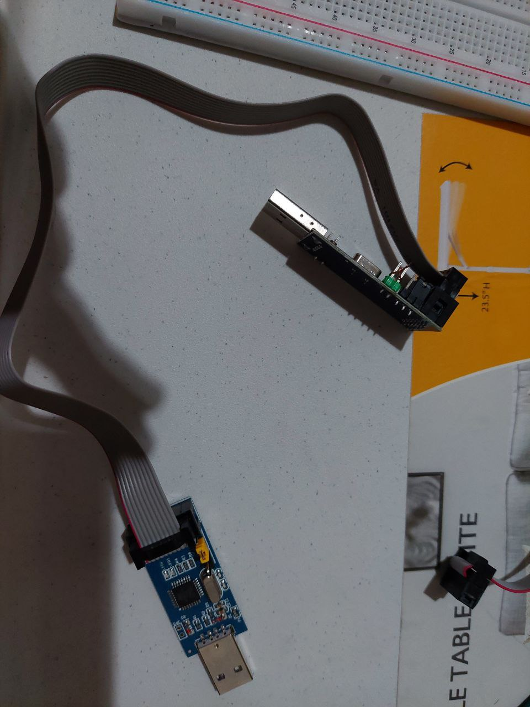

# AVR Programming

## IDE

```shell
flatpak install flathub cc.arduino.IDE2

```

add your username to `dialout` group

```shell
sudo usermod -aG dialout fahmad
```

- https://docs.arduino.cc/software/ide-v2/tutorials/getting-started/ide-v2-downloading-and-installing
- https://arduino.github.io/arduino-cli/0.27/
- https://developer.fedoraproject.org/start/hw/arduino/about.html

## USBasp

https://www.fischl.de/usbasp/

```shell
lsusb -v

Bus 005 Device 008: ID 16c0:05dc Van Ooijen Technische Informatica shared ID for use with libusb
Device Descriptor:
  bLength                18
  bDescriptorType         1
  bcdUSB               1.10
  bDeviceClass          255 Vendor Specific Class
  bDeviceSubClass         0
  bDeviceProtocol         0
  bMaxPacketSize0         8
  idVendor           0x16c0 Van Ooijen Technische Informatica
  idProduct          0x05dc shared ID for use with libusb
  bcdDevice            1.02
  iManufacturer           1 www.fischl.de
  iProduct                2 USBasp
  iSerial                 0
  bNumConfigurations      1
  Configuration Descriptor:
    bLength                 9
    bDescriptorType         2
    wTotalLength       0x0012
    bNumInterfaces          1
    bConfigurationValue     1
    iConfiguration          0
    bmAttributes         0x80
      (Bus Powered)
    MaxPower               50mA
    Interface Descriptor:
      bLength                 9
      bDescriptorType         4
      bInterfaceNumber        0
      bAlternateSetting       0
      bNumEndpoints           0
      bInterfaceClass         0
      bInterfaceSubClass      0
      bInterfaceProtocol      0
      iInterface              0
Device Status:     0x0000
  (Bus Powered)

```

add udev rule

```shell
sudo vim /etc/udev/rules.d/99-USBasp.rules
```

add the following

```shell
SUBSYSTEM=="usb", ATTRS{idVendor}=="16c0", ATTRS{idProduct}=="05dc", GROUP="dialout"
```

reload

```shell
udevadm control --reload
```

### Warning: cannot set sck period

```shell
[fahmad@ryzen ~]$  avrdude -cusbasp -pm328p -Pusb

avrdude: warning: cannot set sck period. please check for usbasp firmware update.
avrdude: AVR device initialized and ready to accept instructions

Reading | ################################################## | 100% 0.00s

avrdude: Device signature = 0x1e950f (probably lgt8fx328p)

avrdude: safemode: Fuses OK (E:FD, H:DE, L:FF)

avrdude done.  Thank you.

```

solder header pin on JP2 and connect the two of them


connect the first usbasp to the second usbasp



update firmware

```shell
cd usbasp
tar xvf usbasp.2011-05-28.tar.gz
cd usbasp.2011-05-28
[fahmad@ryzen usbasp.2011-05-28]$  avrdude -p atmega8 -c usbasp -U flash:w:bin/firmware/usbasp.atmega8.2011-05-28.hex:i -F -P usb

avrdude: warning: cannot set sck period. please check for usbasp firmware update.

avrdude: AVR device initialized and ready to accept instructions

Reading | ################################################## | 100% 0.00s

avrdude: Device signature = 0x1e950f (probably lgt8fx328p)
avrdude: Expected signature for ATmega8 is 1E 93 07
avrdude: NOTE: "flash" memory has been specified, an erase cycle will be performed
         To disable this feature, specify the -D option.
avrdude: erasing chip
avrdude: warning: cannot set sck period. please check for usbasp firmware update.
avrdude: reading input file "bin/firmware/usbasp.atmega8.2011-05-28.hex"
avrdude: writing flash (4700 bytes):

Writing | ################################################## | 100% 2.99s

avrdude: 4700 bytes of flash written
avrdude: verifying flash memory against bin/firmware/usbasp.atmega8.2011-05-28.hex:
avrdude: load data flash data from input file bin/firmware/usbasp.atmega8.2011-05-28.hex:
avrdude: input file bin/firmware/usbasp.atmega8.2011-05-28.hex contains 4700 bytes
avrdude: reading on-chip flash data:

Reading | ################################################## | 100% 2.37s

avrdude: verifying ...
avrdude: 4700 bytes of flash verified

avrdude: safemode: Fuses OK (E:FF, H:DE, L:FF)

avrdude done.  Thank you.
```

## 168 and 328

https://docs.arduino.cc/hacking/hardware/Atmega168Hardware

https://docs.arduino.cc/hacking/hardware/ATMEGA328P

https://docs.arduino.cc/hacking/hardware/PinMapping168

## references

- https://wiki.archlinux.org/title/Udev
- https://klamfx.wordpress.com/2017/05/18/geting-usbasp-v2-0-to-work-on-linux/
- https://forum.arduino.cc/t/usb-asp-not-working-on-linux/248664/5
- https://blog.podkalicki.com/how-to-update-avr-usbasp-firmware-to-latest-version/

https://www.youtube.com/watch?v=A-6HLM1XL3M

https://www.youtube.com/watch?v=1tU7cAFwzig

https://www.youtube.com/watch?v=ToKerwRR-70
